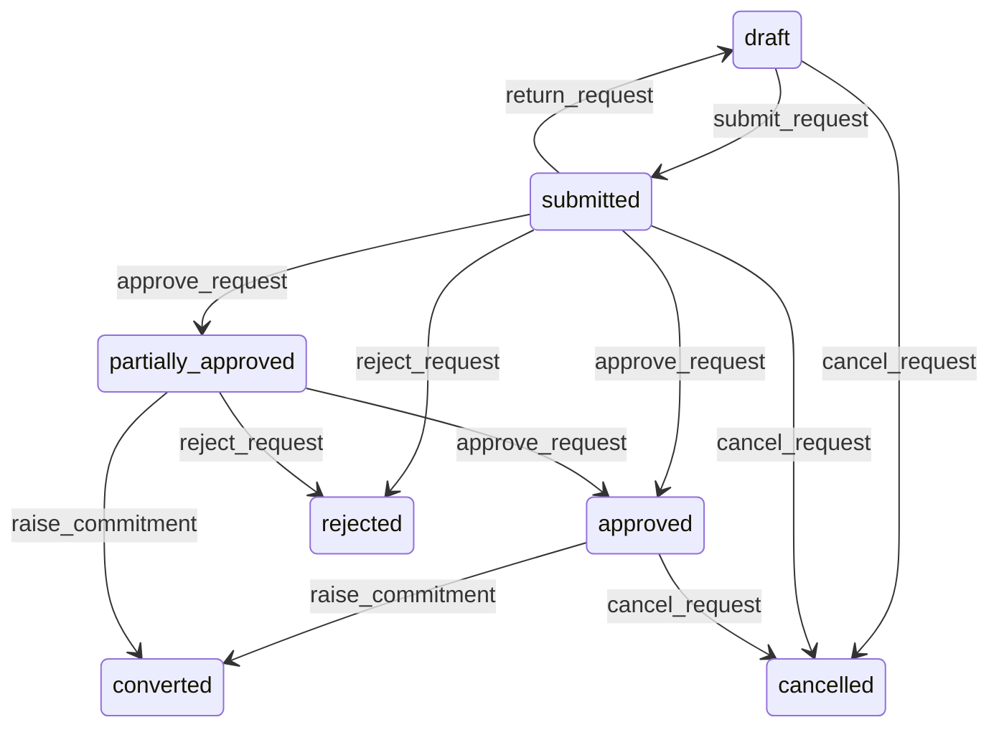

# State machine — Purchase Request

*Generated. Edit `_model/capabilities/procurement.yaml`, not this file.*

## Transition matrix

| From \\ To | `draft` | `submitted` | `partially_approved` | `approved` | `rejected` | `converted` | `cancelled` |
|---|---|---|---|---|---|---|---|
| **`draft`** | · | `submit_request` | — | — | — | — | `cancel_request` |
| **`submitted`** | `return_request` | · | `approve_request` | `approve_request` | `reject_request` | — | `cancel_request` |
| **`partially_approved`** | — | — | · | `approve_request` | `reject_request` | `raise_commitment` | — |
| **`approved`** | — | — | — | · | — | `raise_commitment` | `cancel_request` |
| **`rejected`** | — | — | — | — | · | — | — |
| **`converted`** | — | — | — | — | — | · | — |
| **`cancelled`** | — | — | — | — | — | — | · |

Any transition marked `—` attempted at runtime returns `E_PRECONDITION`. It is never a silent no-op, because a silent no-op is how an operator believes work was recorded when it was not.

## Stuck-state policy

### `draft`

Threshold: draft_request_stale_days (default 7). Told: the requester only. Escape hatch: submit or cancel. The characteristic failure is somebody starting a request, being interrupted, and the thing still being needed a fortnight later - which is why the notification names the needed_by date where one is set.

### `submitted`

An unanswered request is the most common quiet grievance in an operation and the most common cause of somebody buying something with their own money. Threshold: approval_response_days (default 3), or immediately where needed_by is within that window. Told: the approver, then their manager where the org_structure port resolves one, then ops_manager. The requester is shown that it is still waiting rather than being left to guess. Escape hatch: approve, reject or return. Never auto-approved and never auto-rejected - one commits money nobody agreed to and the other silently refuses something that may be urgent.

### `partially_approved`

Worse than submitted because it reads as progress. Same thresholds, and every notification names the OUTSTANDING lines rather than the approved ones. Told: the approver and the requester. Escape hatch: decide the remaining lines, or convert the approved ones and leave the rest.

### `approved`

Approved and unconverted is the state where everybody believes the thing is on order and nobody has ordered it. Threshold: conversion_lag_days (default 2), or immediately where needed_by is inside the supplier's typical lead time. Told: whoever holds create on commitments, then ops_manager. Escape hatch: raise a commitment, or cancel with a reason. This is the single most damaging quiet state in the capability.

### `rejected`

Terminal. Retained with the reason. The monitored condition is a pattern - a requester whose requests are rejected above rejection_rate_alert (default 0.3), or an approver who rejects above the same rate. Told: ops_manager, quarterly. Both directions matter: one is somebody asking for the wrong things and the other is a bottleneck that people will route around.

### `converted`

Terminal. Retained as the origin of the commitment, so that a purchase can always be traced back to who asked for it and why. Nothing pends.

### `cancelled`

Terminal. Retained with the reason. Nothing pends.

