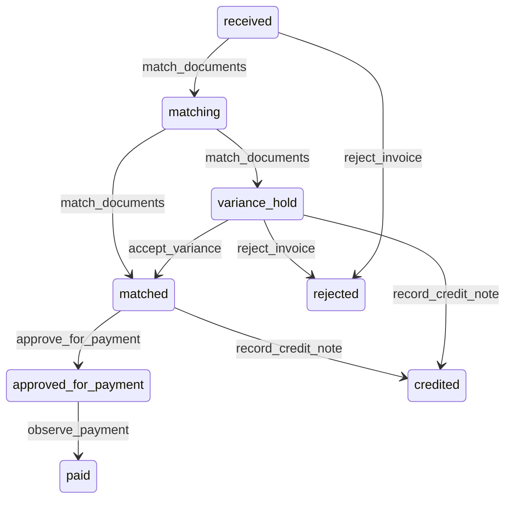

# State machine — Supplier Invoice

*Generated. Edit `_model/capabilities/procurement.yaml`, not this file.*

## Transition matrix

| From \\ To | `received` | `matching` | `matched` | `variance_hold` | `approved_for_payment` | `paid` | `rejected` | `credited` |
|---|---|---|---|---|---|---|---|---|
| **`received`** | · | `match_documents` | — | — | — | — | `reject_invoice` | — |
| **`matching`** | — | · | `match_documents` | `match_documents` | — | — | — | — |
| **`matched`** | — | — | · | — | `approve_for_payment` | — | — | `record_credit_note` |
| **`variance_hold`** | — | — | `accept_variance` | · | — | — | `reject_invoice` | `record_credit_note` |
| **`approved_for_payment`** | — | — | — | — | · | `observe_payment` | — | — |
| **`paid`** | — | — | — | — | — | · | — | — |
| **`rejected`** | — | — | — | — | — | — | · | — |
| **`credited`** | — | — | — | — | — | — | — | · |

Any transition marked `—` attempted at runtime returns `E_PRECONDITION`. It is never a silent no-op, because a silent no-op is how an operator believes work was recorded when it was not.

## Stuck-state policy

### `received`

An unmatched invoice sitting in a queue is where late-payment charges come from. Threshold: match_start_days (default 2). Told: finance. Escape hatch: match or reject. An invoice with no identifiable commitment is reported separately, because it is either an unrecorded purchase, a duplicate under a different number, or a supplier billing the wrong tenant, and all three need a person rather than a queue.

### `matching`

Threshold: match_lag_days (default 5). Told: finance. Escape hatch: complete the match or move to variance hold. Matching that stalls is usually a receipt that has not been recorded, and the notification says so and names the commitment, because that is the action that unblocks it.

### `matched`

Matched and unapproved is a liability nobody has authorised. Threshold: due_date minus payment_approval_lead_days (default 3), or approval_lag_days (default 5) where no due date is known. Told: finance, then tenant_owner. Escape hatch: approve or dispute.

### `variance_hold`

A held invoice is a supplier not being paid and a relationship deteriorating. Threshold: variance_resolution_days (default 5), escalating to ops_manager then tenant_owner. Told: finance and the requesting location, because the location frequently knows why the quantity differs and finance does not. Escape hatch: accept with a reason, reject, or obtain a credit. Never auto-accepted at any tolerance, because auto-accepting a variance is paying more than was agreed without anybody agreeing to it.

### `approved_for_payment`

Approved and unpaid past its due date is a late payment with a known owner. Threshold: the due date. Told: finance and tenant_owner. Escape hatch: pay, or record why not. The specific monitored case is an approved invoice whose payment never returns a reference, which means the two systems disagree about whether a supplier has been paid - the most expensive divergence available here.

### `paid`

Terminal. Retained permanently with its payment reference, which is the join between this capability and wherever money actually moved. Nothing pends.

### `rejected`

Terminal. Retained, because a rejected invoice that is re-sent unchanged is a pattern worth seeing, and because a supplier will produce their copy.

### `credited`

Terminal. Retained with the credit note reference. The monitored exception is a credit expectation raised by a return that has no matching credit note after credit_expectation_days. Told: finance, with the value, because uncollected supplier credits are quiet loss.

