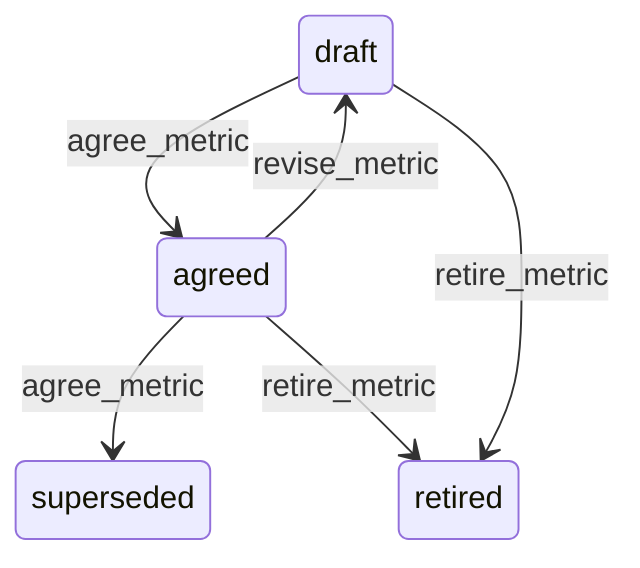

# State machine — Metric Definition

*Generated. Edit `_model/capabilities/reporting.yaml`, not this file.*

## Transition matrix

| From \\ To | `draft` | `agreed` | `superseded` | `retired` |
|---|---|---|---|---|
| **`draft`** | · | `agree_metric` | — | `retire_metric` |
| **`agreed`** | `revise_metric` | · | `agree_metric` | `retire_metric` |
| **`superseded`** | — | — | · | — |
| **`retired`** | — | — | — | · |

Any transition marked `—` attempted at runtime returns `E_PRECONDITION`. It is never a silent no-op, because a silent no-op is how an operator believes work was recorded when it was not.

## Stuck-state policy

### `draft`

A metric in draft is a number somebody wants and nobody has agreed the meaning of. Threshold: draft_metric_stale_days (default 21). Told: the owner. Escape hatch: agree or retire. The characteristic failure is a definition drafted during a disagreement about a figure and abandoned once the immediate argument ended, leaving the disagreement unresolved and available to recur.

### `agreed`

Steady state. Three monitored conditions. (a) A metric whose computed value moves by more than definition_shift_alert (default 0.5) between consecutive periods with no underlying volume change, which usually means a filter that has stopped matching after a configuration change elsewhere. Told: the owner. (b) A metric never queried for unused_metric_days (default 180) - somebody agreed a definition nobody uses, which is cost and clutter. (c) A metric whose exclusions now remove more than exclusion_share_alert of its population (default 0.1), which means the number is increasingly a statement about what was excluded. Told: the owner and tenant_owner, because that is the condition under which a metric quietly stops describing reality.

### `superseded`

Terminal. Retained permanently, because every published figure computed under it must remain reproducible. This is the whole reason definitions are versioned rather than edited. Nothing pends.

### `retired`

Terminal. Retained for the same reason. Nothing pends.

