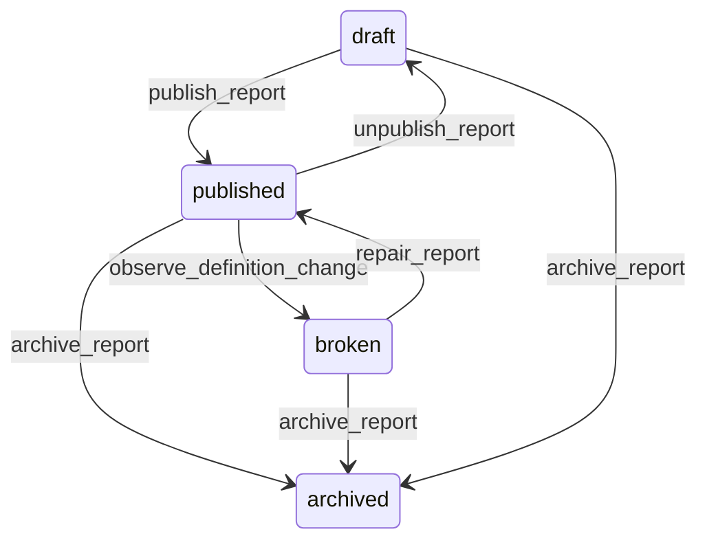

# State machine — Report

*Generated. Edit `_model/capabilities/reporting.yaml`, not this file.*

## Transition matrix

| From \\ To | `draft` | `published` | `broken` | `archived` |
|---|---|---|---|---|
| **`draft`** | · | `publish_report` | — | `archive_report` |
| **`published`** | `unpublish_report` | · | `observe_definition_change` | `archive_report` |
| **`broken`** | — | `repair_report` | · | `archive_report` |
| **`archived`** | — | — | — | · |

Any transition marked `—` attempted at runtime returns `E_PRECONDITION`. It is never a silent no-op, because a silent no-op is how an operator believes work was recorded when it was not.

## Stuck-state policy

### `draft`

Threshold: draft_report_stale_days (default 21). Told: the owner. Escape hatch: publish or archive. Low urgency and the specific confusion is an audience who were told a report exists and cannot find it.

### `published`

Steady state. Two monitored conditions. (a) A scheduled report whose last run failed or did not occur - the audience received nothing and silence is indistinguishable from a report showing no change. Threshold: one missed schedule. Told: the owner and platform_operator, because the cause is usually machinery. (b) A published report never opened by anybody in its audience for unopened_report_days (default 90), which is a report nobody wanted, and where it is scheduled it is also messaging cost for nothing.

### `broken`

A broken report is showing nothing or, worse, showing a figure computed without a removed component. Threshold: immediate. Told: the owner and every audience role, naming the specific broken element. Escape hatch: repair or archive. It is deliberately NOT auto-repaired by dropping the broken metric, because a report that quietly loses a column changes what it means and the audience will read it as though it did not.

