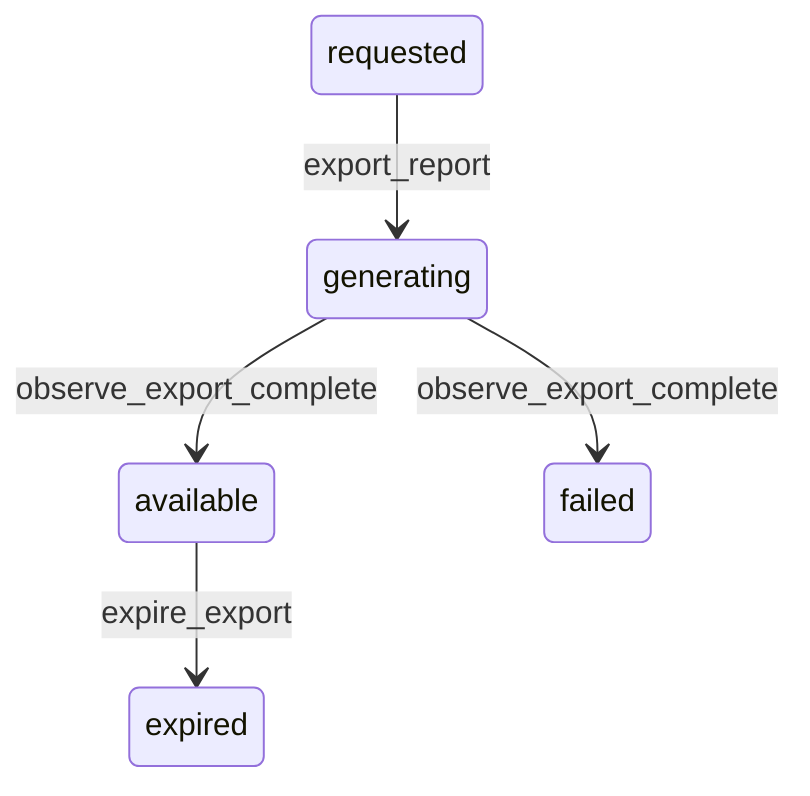

# State machine — Export

*Generated. Edit `_model/capabilities/reporting.yaml`, not this file.*

## Transition matrix

| From \\ To | `requested` | `generating` | `available` | `expired` | `failed` |
|---|---|---|---|---|---|
| **`requested`** | · | `export_report` | — | — | — |
| **`generating`** | — | · | `observe_export_complete` | — | `observe_export_complete` |
| **`available`** | — | — | · | `expire_export` | — |
| **`expired`** | — | — | — | · | — |
| **`failed`** | — | — | — | — | · |

Any transition marked `—` attempted at runtime returns `E_PRECONDITION`. It is never a silent no-op, because a silent no-op is how an operator believes work was recorded when it was not.

## Stuck-state policy

### `requested`

Threshold: export_queue_lag_minutes (default 5). Told: platform_operator. A requester waiting on an export will re-request, which is why the request is idempotent on the run and the parameters.

### `generating`

Threshold: export_generation_minutes (default 15). Told: the requester and platform_operator. Escape hatch: cancel and narrow. A very large export is usually a report that should have been narrowed, and the surface says so rather than grinding.

### `available`

Bounded by expires_at. The monitored condition is an available export never downloaded for undownloaded_export_days (default 3), which is either somebody who changed their mind or a file generated by an automation nobody is consuming - both worth knowing, because both are copies of data sitting outside the record.

### `expired`

Terminal. The file is gone and the record of who exported what, when and why is retained permanently. Nothing pends.

### `failed`

Threshold: immediate. Told: the requester with the reason. Escape hatch: narrow and retry. Nothing else pends.

