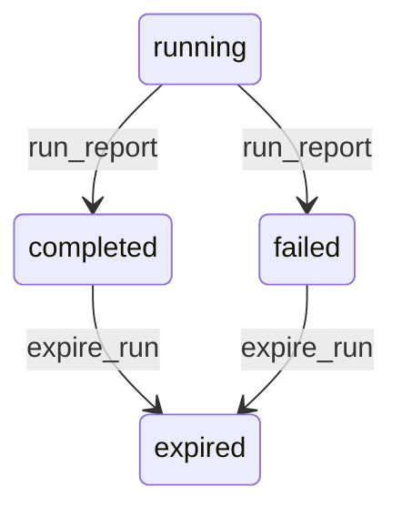

# State machine — Report Run

*Generated. Edit `_model/capabilities/reporting.yaml`, not this file.*

## Transition matrix

| From \\ To | `running` | `completed` | `failed` | `expired` |
|---|---|---|---|---|
| **`running`** | · | `run_report` | `run_report` | — |
| **`completed`** | — | · | — | `expire_run` |
| **`failed`** | — | — | · | `expire_run` |
| **`expired`** | — | — | — | · |

Any transition marked `—` attempted at runtime returns `E_PRECONDITION`. It is never a silent no-op, because a silent no-op is how an operator believes work was recorded when it was not.

## Stuck-state policy

### `running`

A report running far beyond its expected duration is consuming query capacity that operational work needs. Threshold: run_timeout_seconds (default 60 interactive, 600 scheduled). Told: the reader, in place, with the option to narrow the period. Escape hatch: cancel, narrow, or move to an export. A reporting query that can starve operational transactions is the reason interactive runs carry a much shorter timeout than scheduled ones.

### `completed`

Terminal until retention. Nothing pends.

### `failed`

Threshold: immediate. Told: the reader with the specific reason, and the owner where the failure is a definition or dimension problem rather than a transient one. Escape hatch: narrow the period, repair the report, or retry. A failed run must never render as an empty result, because an empty result reads as nothing happened.

### `expired`

Terminal. Metadata retained so that the fact a report was run, by whom and when, survives even after its figures are gone. Nothing pends.

