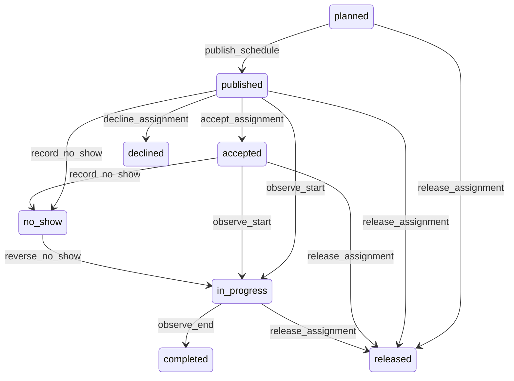

# State machine — Assignment

*Generated. Edit `_model/capabilities/scheduling_dispatch.yaml`, not this file.*

## Transition matrix

| From \\ To | `planned` | `published` | `accepted` | `declined` | `in_progress` | `completed` | `released` | `no_show` |
|---|---|---|---|---|---|---|---|---|
| **`planned`** | · | `publish_schedule` | — | — | — | — | `release_assignment` | — |
| **`published`** | — | · | `accept_assignment` | `decline_assignment` | `observe_start` | — | `release_assignment` | `record_no_show` |
| **`accepted`** | — | — | · | — | `observe_start` | — | `release_assignment` | `record_no_show` |
| **`declined`** | — | — | — | · | — | — | — | — |
| **`in_progress`** | — | — | — | — | · | `observe_end` | `release_assignment` | — |
| **`completed`** | — | — | — | — | — | · | — | — |
| **`released`** | — | — | — | — | — | — | · | — |
| **`no_show`** | — | — | — | — | `reverse_no_show` | — | — | · |

Any transition marked `—` attempted at runtime returns `E_PRECONDITION`. It is never a silent no-op, because a silent no-op is how an operator believes work was recorded when it was not.

## Stuck-state policy

### `planned`

A planned assignment nobody has published is invisible to the person expected to do it. Threshold: publish_lead_hours before starts_at (default 72), or immediately if starts_at is inside that window. Told: the dispatcher. Escape hatch: publish or release. Verity does not auto-publish. Auto-publishing a draft roster is how a half-finished plan becomes a set of commitments at 2am.

### `published`

Where acceptance_required is true, an unanswered publication is a commitment nobody has confirmed. Threshold: acceptance_deadline_hours (default 24, or half the lead time when that is shorter). Told: the resource, then the dispatcher. Escape hatch: the resource accepts or declines, or the dispatcher reassigns. On the deadline the assignment is NOT auto-accepted and NOT auto-released - it is escalated, because both automatic outcomes are wrong and the choice belongs to a person who can see the coverage position.

### `accepted`

Steady state until start. The monitored exception is an accepted assignment whose underlying demand or resource changed after acceptance - the window moved, the location moved, the qualification requirement changed. The version increment and re-notification exist for exactly this, and an accepted assignment whose version has moved without re-acknowledgement is reported to the dispatcher, because the person accepted something different from what now exists.

### `declined`

Terminal for this assignment and an active problem for the demand. Not a queue in itself; the demand's own coverage policy carries the escalation. The monitored exception is a resource declining more than decline_rate_threshold of published assignments over a rolling period (default 0.3), reported to their supervisor rather than to the dispatcher, because a high decline rate is a conversation about the person's circumstances and not a scheduling adjustment.

### `in_progress`

Bounded by ends_at. The monitored exception is an assignment in progress far past its ends_at without transitioning - the scheduler is not running, or the window was wrong. Threshold: overrun_alert_minutes (default 60). Told: the supervisor. Escape hatch: end it, extend it explicitly, or let the producer close it. An assignment silently running for days accumulates overtime and cost against a period nobody agreed.

### `completed`

Terminal from this capability's point of view. Whether the work was actually done, and whether it is billable, are the producer's and the billing sink's questions. Nothing pends here.

### `released`

Terminal. Retained with the reason and the notice given, because the pattern of late releases against one resource is a real grievance and the only place it is visible. Nothing pends.

### `no_show`

An escalation, not a queue. Told at entry to the dispatcher and the supervisor; backfill is sought immediately where the port is bound. The window for reverse_no_show stays open for no_show_reversal_hours (default 48), after which the record is fixed, because a no-show reversed a week later is a payroll correction rather than a scheduling one and belongs in a different conversation.

