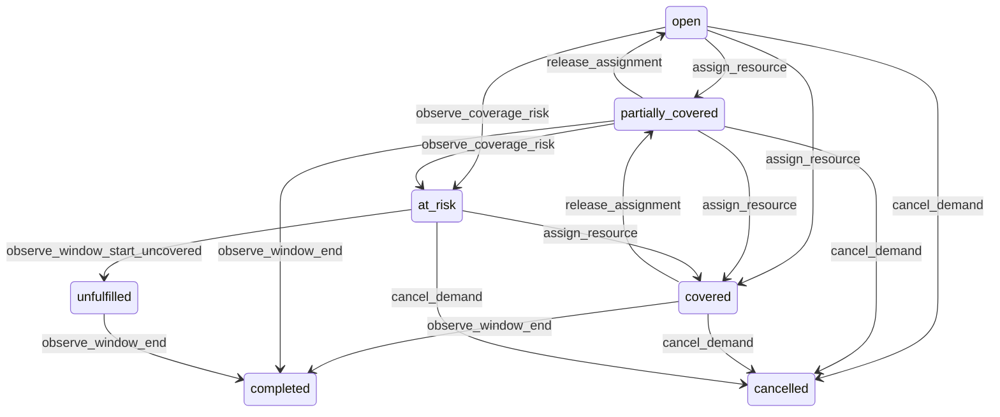

# State machine — Demand

*Generated. Edit `_model/capabilities/scheduling_dispatch.yaml`, not this file.*

## Transition matrix

| From \\ To | `open` | `partially_covered` | `covered` | `at_risk` | `unfulfilled` | `cancelled` | `completed` |
|---|---|---|---|---|---|---|---|
| **`open`** | · | `assign_resource` | `assign_resource` | `observe_coverage_risk` | — | `cancel_demand` | — |
| **`partially_covered`** | `release_assignment` | · | `assign_resource` | `observe_coverage_risk` | — | `cancel_demand` | `observe_window_end` |
| **`covered`** | — | `release_assignment` | · | — | — | `cancel_demand` | `observe_window_end` |
| **`at_risk`** | — | — | `assign_resource` | · | `observe_window_start_uncovered` | `cancel_demand` | — |
| **`unfulfilled`** | — | — | — | — | · | — | `observe_window_end` |
| **`cancelled`** | — | — | — | — | — | · | — |
| **`completed`** | — | — | — | — | — | — | · |

Any transition marked `—` attempted at runtime returns `E_PRECONDITION`. It is never a silent no-op, because a silent no-op is how an operator believes work was recorded when it was not.

## Stuck-state policy

### `open`

An open demand approaching its window with nobody assigned is the core operational failure this capability exists to prevent. Threshold: coverage_risk_lead_minutes, which is priority-dependent - default 2880 minutes for routine, 1440 elevated, 240 urgent, 60 critical - at which point it moves to at_risk rather than merely being reported. Told: the dispatcher. Escape hatch: assign, or cancel through the producer. Deliberately NOT an escape hatch - auto-assigning the nearest available resource, because an auto-assignment made at the deadline is the one nobody has checked.

### `partially_covered`

Worse than open, because it looks staffed on a summary screen. Same thresholds as open, and the notification always names the SHORTFALL rather than the coverage - two of three is reported as one short, not as sixty-seven percent, because a percentage is what makes a shortfall look acceptable. Told: the dispatcher, and at critical priority ops_manager.

### `covered`

Steady state until the window. The monitored exception is coverage that decays - an assignment declined or released after the demand was reported covered to the producer. The producer is told of the change explicitly rather than being left with a stale belief, which matters because the producer may have already told a counterparty.

### `at_risk`

This is an escalation, not a queue. Notification cadence increases as window_start approaches - at entry, at half the remaining lead time, and every at_risk_repeat_minutes (default 15) in the final hour. Told: the dispatcher, then ops_manager, then at critical priority the tenant_owner. Escape hatch: cover it, reduce required_count with a recorded reason, or cancel. There is no automatic resolution and there is no snooze, because a snoozed unstaffed commitment is an unstaffed commitment.

### `unfulfilled`

A recorded failure rather than a queue. It stops escalating on entry, because the moment has passed and continuing to page people about it trains them to ignore pages. Told once, to ops_manager, with the shortfall, the reason and the producer. It appears permanently in coverage reporting. Escape hatch: none - the purpose of the state is that the failure is not erasable.

### `cancelled`

Terminal. Retained with the cancelling producer, the timestamp relative to cancellation_deadline_at, and the assignments that were released, because a late cancellation frequently has a cost and this row is the evidence for it. Nothing pends.

### `completed`

Terminal here. Whether the work was actually done, and whether it is billable, are the producing capability's questions and the billing sink's questions. This capability asserts only that the window ended with the assignments in terminal states. Nothing pends.

