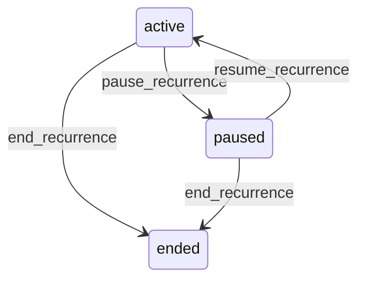

# State machine — Recurrence Pattern

*Generated. Edit `_model/capabilities/scheduling_dispatch.yaml`, not this file.*

## Transition matrix

| From \\ To | `active` | `paused` | `ended` |
|---|---|---|---|
| **`active`** | · | `pause_recurrence` | `end_recurrence` |
| **`paused`** | `resume_recurrence` | · | `end_recurrence` |
| **`ended`** | — | — | · |

Any transition marked `—` attempted at runtime returns `E_PRECONDITION`. It is never a silent no-op, because a silent no-op is how an operator believes work was recorded when it was not.

## Stuck-state policy

### `active`

The dangerous condition is a pattern whose materialised_to has fallen behind the horizon, which means demand that should exist does not, and nothing anywhere shows a gap because you cannot see demand that was never created. Threshold: materialised_to earlier than today plus materialisation_lag_alert_days (default 14). Told: platform_operator, because this is generation machinery, AND ops_manager, because the operational consequence is theirs. Escape hatch: run generation. This is the highest-value monitor in the capability and it is deliberately reported to both sides, since each alone would assume the other was handling it.

### `paused`

Threshold: recurrence_pause_review_days (default 14). Told: the pausing principal and ops_manager. Escape hatch: resume or end. A paused pattern produces no demand, and a pattern paused for a fortnight is usually one somebody forgot, which surfaces as an empty roster.

### `ended`

Terminal. Retained, because the pattern is the explanation for demand that already exists. Nothing pends.

