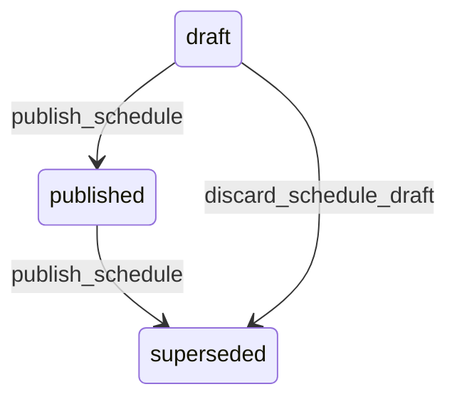

# State machine — Schedule Version

*Generated. Edit `_model/capabilities/scheduling_dispatch.yaml`, not this file.*

## Transition matrix

| From \\ To | `draft` | `published` | `superseded` |
|---|---|---|---|
| **`draft`** | · | `publish_schedule` | `discard_schedule_draft` |
| **`published`** | — | · | `publish_schedule` |
| **`superseded`** | — | — | · |

Any transition marked `—` attempted at runtime returns `E_PRECONDITION`. It is never a silent no-op, because a silent no-op is how an operator believes work was recorded when it was not.

## Stuck-state policy

### `draft`

A draft roster that never publishes is the single most common cause of a location being unstaffed by surprise, because the dispatcher believes it is done. Threshold: publish_lead_hours before period_start (default 72). Told: the dispatcher, then ops_manager at half the remaining lead. Escape hatch: publish or discard. No auto-publish, for the same reason as on the assignment.

### `published`

Steady state. The monitored exception is a published version with a non-zero coverage_shortfall_count and no subsequent version - the shortfall was acknowledged and then never resolved. Told: ops_manager, daily until the period starts.

### `superseded`

Terminal. Retained permanently. This is the evidence of what people were told and when, which is what a roster dispute is actually about. Nothing pends.

