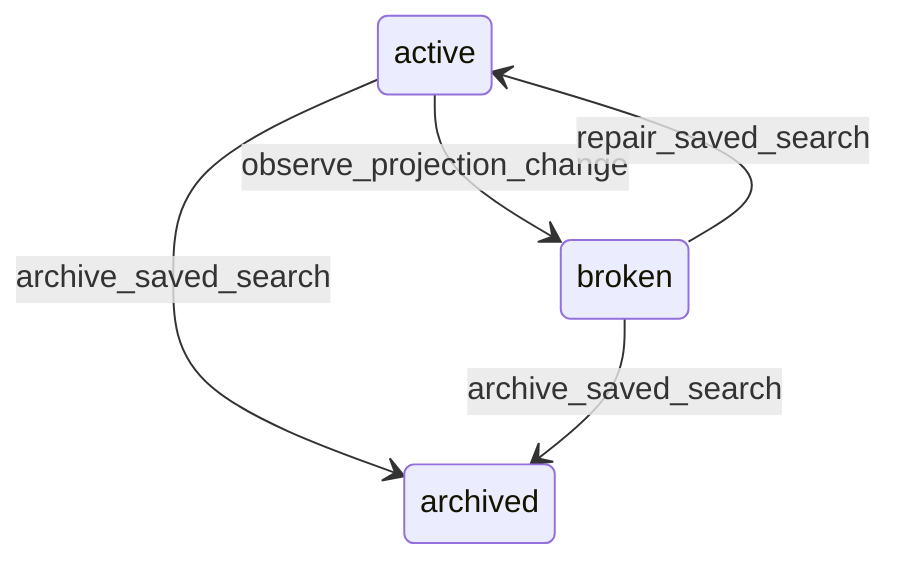

# State machine — Saved Search

*Generated. Edit `_model/capabilities/search.yaml`, not this file.*

## Transition matrix

| From \\ To | `active` | `broken` | `archived` |
|---|---|---|---|
| **`active`** | · | `observe_projection_change` | `archive_saved_search` |
| **`broken`** | `repair_saved_search` | · | `archive_saved_search` |
| **`archived`** | — | — | · |

Any transition marked `—` attempted at runtime returns `E_PRECONDITION`. It is never a silent no-op, because a silent no-op is how an operator believes work was recorded when it was not.

## Stuck-state policy

### `active`

The monitored exception is a saved search with notify_on_new_results whose result set has grown by more than saved_search_growth_alert (default 10 times) since it was created, which usually means a filter that was narrow when written and is now broad. The subscriber is told before the notification volume arrives rather than afterwards. A second condition is a saved search never run for unused_saved_search_days (default 180), reported to its owner only.

### `broken`

A broken saved search is silently returning nothing or returning the wrong thing. Threshold: immediate on detection. Told: the owner and every sharing role, naming the specific element that no longer exists. Escape hatch: repair or archive. It is deliberately NOT auto-repaired by dropping the broken element, because a filter silently dropped changes what the search means and the person will read the result as though it still meant what it did.

