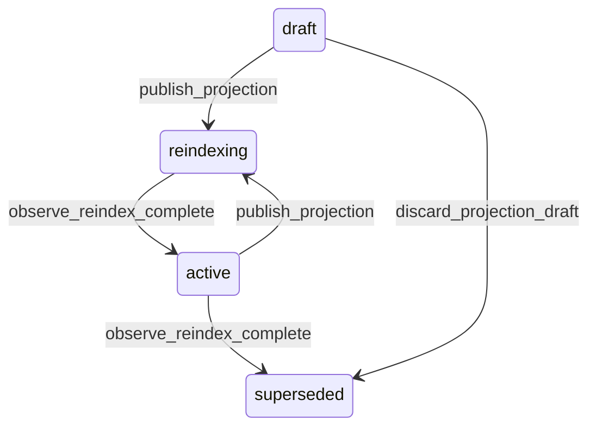

# State machine — Search Projection

*Generated. Edit `_model/capabilities/search.yaml`, not this file.*

## Transition matrix

| From \\ To | `draft` | `active` | `reindexing` | `superseded` |
|---|---|---|---|---|
| **`draft`** | · | — | `publish_projection` | `discard_projection_draft` |
| **`active`** | — | · | `publish_projection` | `observe_reindex_complete` |
| **`reindexing`** | — | `observe_reindex_complete` | · | — |
| **`superseded`** | — | — | — | · |

Any transition marked `—` attempted at runtime returns `E_PRECONDITION`. It is never a silent no-op, because a silent no-op is how an operator believes work was recorded when it was not.

## Stuck-state policy

### `draft`

Threshold: draft_projection_stale_days (default 14). Told: the author. Escape hatch: publish or discard. The characteristic confusion is somebody having added a field to the projection and finding that searching for it returns nothing.

### `active`

Three monitored conditions. (a) A projection whose index lag exceeds freshness_target_seconds for longer than lag_alert_minutes (default 5) - results are stale and every surface showing them must say so. Told: platform_operator. (b) A projection whose queries are re-checking more than recheck_rate_alert of candidates (default 0.3) because a scope filter cannot be applied in the index - correct, slow, and a sign that scope_fields is incomplete. (c) A projection with fields that no query has ever matched on over unused_field_days (default 90), which is index cost for nothing.

### `reindexing`

A reindex that does not finish leaves the previous version serving, which is safe and means the newly projected fields are silently unsearchable. Threshold: reindex_stall_minutes (default 30) with no cursor progress. Told: platform_operator. Escape hatch: restart, or reduce the scope. The important property is that search continues to work throughout, so the failure is invisible to users and must therefore be visible to operators.

### `superseded`

Terminal. Retained so that a query executed against it remains explicable. Nothing pends.

