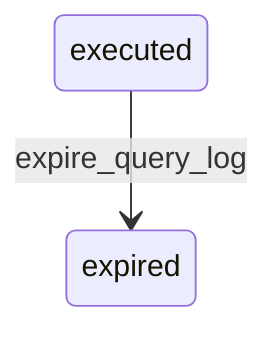

# State machine — Search Query

*Generated. Edit `_model/capabilities/search.yaml`, not this file.*

## Transition matrix

| From \\ To | `executed` | `expired` |
|---|---|---|
| **`executed`** | · | `expire_query_log` |
| **`expired`** | — | · |

Any transition marked `—` attempted at runtime returns `E_PRECONDITION`. It is never a silent no-op, because a silent no-op is how an operator believes work was recorded when it was not.

## Stuck-state policy

### `executed`

Query records do not pend individually. Two conditions on the population are monitored here. (a) A principal executing more than exfiltration_rate_threshold queries in an hour with a high result count and a low selection rate, which is the shape of somebody paginating an entire dataset through the search box rather than looking for something. Told: tenant_owner and platform_operator, and this is deliberately a security monitor rather than a capacity one. (b) A rising rate of queries returning nothing for terms that look like identifiers, which usually means an entity somebody expects to be searchable is not projected. Told: platform_operator, weekly.

### `expired`

Terminal. The term is gone and the metrics remain. Nothing pends.

