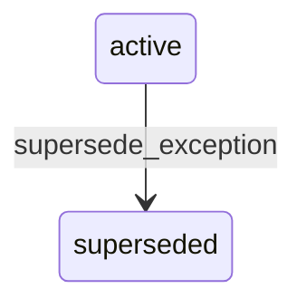

# State machine — Calendar Exception

*Generated. Edit `_model/capabilities/sites.yaml`, not this file.*

## Transition matrix

| From \\ To | `active` | `superseded` |
|---|---|---|
| **`active`** | · | `supersede_exception` |
| **`superseded`** | — | · |

Any transition marked `—` attempted at runtime returns `E_PRECONDITION`. It is never a silent no-op, because a silent no-op is how an operator believes work was recorded when it was not.

## Stuck-state policy

### `active`

Not a queue. The monitored exception is an exception in the past that was never applied because it was created after the date it covers - a retroactive holiday. Told: ops_manager, with the count of operational records that resolved against the old hours and would resolve differently now. Escape hatch: review those records explicitly. Verity never silently re-resolves history, and the notification exists precisely so that the manual correction is a decision rather than an accident.

### `superseded`

Terminal. Retained so that historical resolution is reproducible. Nothing pends.

