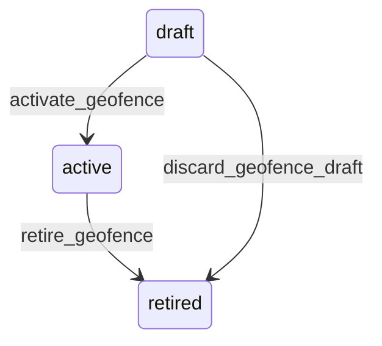

# State machine — Geofence

*Generated. Edit `_model/capabilities/sites.yaml`, not this file.*

## Transition matrix

| From \\ To | `draft` | `active` | `retired` |
|---|---|---|---|
| **`draft`** | · | `activate_geofence` | `discard_geofence_draft` |
| **`active`** | — | · | `retire_geofence` |
| **`retired`** | — | — | · |

Any transition marked `—` attempted at runtime returns `E_PRECONDITION`. It is never a silent no-op, because a silent no-op is how an operator believes work was recorded when it was not.

## Stuck-state policy

### `draft`

Threshold: draft_geofence_stale_days (default 14). Told: the creating principal. Escape hatch: activate or discard. The operational risk is low and the confusion risk is high, because somebody drew a boundary on a map and believes it is in force.

### `active`

The single most important monitored condition in this capability. Three triggers. (a) A geofence returning inconclusive for more than inconclusive_rate_threshold of evaluations (default 0.2) over a rolling week - the boundary or the accuracy floor is wrong, or the location is indoors and GPS cannot serve it. (b) A geofence returning outside for more than outside_rate_threshold (default 0.3) - almost always a wrong centre point rather than a workforce that has collectively stopped turning up. (c) A geofence whose location position has moved since it was drawn. Told: ops_manager and the supervisor of that location, weekly, with the rates and a map. Escape hatch: adjust and version, or retire. Verity does NOT auto-tune the boundary, because auto-widening a geofence until it stops complaining is how presence evidence becomes worthless while continuing to look green.

### `retired`

Terminal. Retained permanently so historical evidence remains reproducible against the boundary that was actually in force. Nothing pends.

