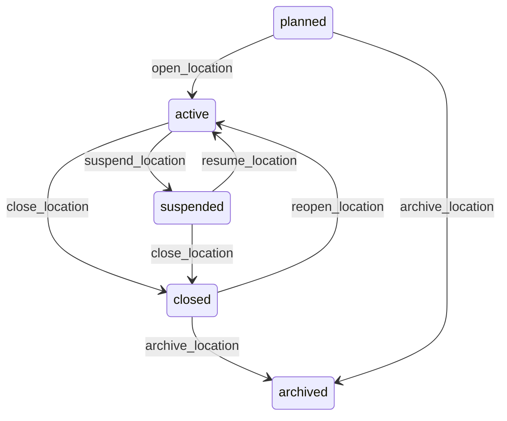

# State machine — Location

*Generated. Edit `_model/capabilities/sites.yaml`, not this file.*

## Transition matrix

| From \\ To | `planned` | `active` | `suspended` | `closed` | `archived` |
|---|---|---|---|---|---|
| **`planned`** | · | `open_location` | — | — | `archive_location` |
| **`active`** | — | · | `suspend_location` | `close_location` | — |
| **`suspended`** | — | `resume_location` | · | `close_location` | — |
| **`closed`** | — | `reopen_location` | — | · | `archive_location` |
| **`archived`** | — | — | — | — | · |

Any transition marked `—` attempted at runtime returns `E_PRECONDITION`. It is never a silent no-op, because a silent no-op is how an operator believes work was recorded when it was not.

## Stuck-state policy

### `planned`

A location planned and never opened is a mobilisation that stalled, and it is invisible because planned locations are excluded from operational lists. Threshold: planned_location_stale_days (default 60). Told: the creating principal and ops_manager. Escape hatch: open or archive. Verity never auto-opens - opening a location makes it assignable, and assigning work to a location that is not ready is an operational failure with a person standing outside a locked gate at 6am.

### `active`

Steady state. Two monitored exceptions. (a) An active location with no activity of any kind for inactive_location_days (default 90) - usually a location that closed in reality and not in the system, which quietly inflates every per-location metric. Told: ops_manager, monthly, as a list. (b) An active location whose position is null or whose position_accuracy_m exceeds geofence_usable_accuracy_m while any capability is relying on a geofence there. This is a silent correctness failure - the geofence appears to work and is measuring nothing - and it is reported immediately rather than on a timer.

### `suspended`

Threshold: location_suspension_review_days (default 30). Told: the suspending principal, escalating to ops_manager. Escape hatch: resume or close. A suspended location still consumes any per-location plan entitlement and the review notification says so, because a suspended location silently costing money is the kind of thing discovered during a contract renewal argument.

### `closed`

Closed is a valid long-term state and most closed locations stay closed. The monitored exception is a closed location that still has future-dated assignments or an unclosed obligation against it, which should have been caught by the close guard and indicates that something was created against it afterwards. Told: ops_manager and the assignment owner. Escape hatch: reassign, or reopen. Threshold is immediate, not timed, because a future assignment at a closed location is a person who will be sent somewhere that no longer operates.

