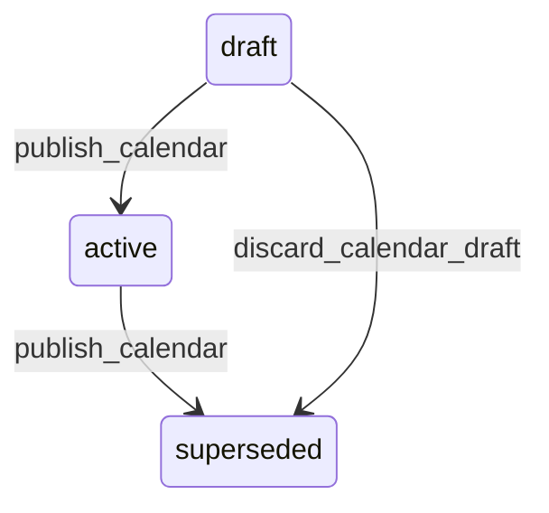

# State machine — Operating Calendar

*Generated. Edit `_model/capabilities/sites.yaml`, not this file.*

## Transition matrix

| From \\ To | `draft` | `active` | `superseded` |
|---|---|---|---|
| **`draft`** | · | `publish_calendar` | `discard_calendar_draft` |
| **`active`** | — | · | `publish_calendar` |
| **`superseded`** | — | — | · |

Any transition marked `—` attempted at runtime returns `E_PRECONDITION`. It is never a silent no-op, because a silent no-op is how an operator believes work was recorded when it was not.

## Stuck-state policy

### `draft`

Threshold: draft_calendar_stale_days (default 14). Told: the creating principal. Escape hatch: publish or discard. A draft calendar is harmless except that the location it was being written for is still resolving against something else, and the person who wrote it usually believes otherwise.

### `active`

Steady state. Monitored exception: a calendar with no exception entries at all for calendar_exception_absence_days (default 400) while the location it serves has recorded activity on days a published holiday list marks as non-working. This indicates the exceptions were never maintained, which shows up months later as a billing dispute about premium rates. Told: ops_manager, annually, with the specific dates. Deliberately advisory - Verity does not ship a holiday list, because the correct list depends on the location, the workforce and the contract, and shipping a wrong one is worse than shipping none.

### `superseded`

Terminal. Retained permanently, because historical records resolve against the version that was active at the time. Nothing pends.

