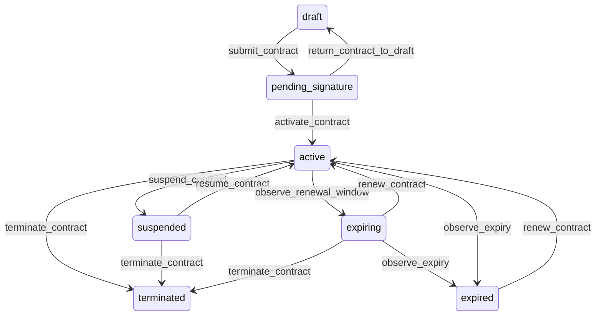

# State machine — Contract

*Generated. Edit `_model/capabilities/sla_contract.yaml`, not this file.*

## Transition matrix

| From \\ To | `draft` | `pending_signature` | `active` | `suspended` | `expiring` | `expired` | `terminated` |
|---|---|---|---|---|---|---|---|
| **`draft`** | · | `submit_contract` | — | — | — | — | — |
| **`pending_signature`** | `return_contract_to_draft` | · | `activate_contract` | — | — | — | — |
| **`active`** | — | — | · | `suspend_contract` | `observe_renewal_window` | `observe_expiry` | `terminate_contract` |
| **`suspended`** | — | — | `resume_contract` | · | — | — | `terminate_contract` |
| **`expiring`** | — | — | `renew_contract` | — | · | `observe_expiry` | `terminate_contract` |
| **`expired`** | — | — | `renew_contract` | — | — | · | — |
| **`terminated`** | — | — | — | — | — | — | · |

Any transition marked `—` attempted at runtime returns `E_PRECONDITION`. It is never a silent no-op, because a silent no-op is how an operator believes work was recorded when it was not.

## Stuck-state policy

### `draft`

Threshold: draft_contract_stale_days (default 30). Told: the drafting principal and the contract owner. Escape hatch: submit or discard. Low urgency, and the specific risk is that work is already being performed against terms that exist only in a draft, so the notification asks whether any work is already under way.

### `pending_signature`

The state where work is most often already happening. Threshold: signature_chase_days (default 14), then weekly. Told: the contract owner and finance, and the notification carries the count of records already created within the contract's scope, because that count is the argument for chasing. Escape hatch: activate with the document absence acknowledged, or return to draft. Verity never auto-activates on the strength of work having started.

### `active`

Steady state. Three monitored exceptions. (a) A contract with no service_level and a billing_basis other than none - it obliges money without obliging performance, which is legitimate and worth confirming once. (b) A contract whose penalty accrual in the current measurement period has passed penalty_warning_fraction of its cap (default 0.5). Told: finance, the contract owner and ops_manager, because at that point the operational fix is still possible and after the cap it is not. (c) A contract whose scope resolves to zero records for scope_dry_days (default 60) - almost always a scope expression that stopped matching after a reorganisation, and it silently means nothing is being measured.

### `suspended`

Threshold: contract_suspension_review_days (default 30). Told: finance and the contract owner, escalating to tenant_owner. Escape hatch: resume or terminate. A suspended contract with running clocks is the specific condition worth naming in the notification, because people assume suspension stops everything and it does not.

### `expiring`

Bounded by ends_on. Notifications at the renewal notice date, then at half the remaining time, then weekly, then daily in the final week. Told: the contract owner, finance, and the relationship owner. Escape hatch: renew, supersede, or let it expire deliberately. Verity never auto-renews even where auto_renew is true - it creates the successor in draft and tells somebody, because an automatically renewed contract at unchanged prices is a commercial decision made by a scheduler.

### `expired`

Not terminal in effect, because running clocks continue and work already accepted is still owed. The monitored exception is work still being performed within an expired contract's scope, reported daily to the contract owner and finance with the count and the value, because that work is being done for terms nobody has agreed. Escape hatch: renew retrospectively, activate a successor, or stop the work.

### `terminated`

Terminal. Retained permanently. Running clocks that were live at termination are measured to their conclusion and reported, because the obligation existed when the work was accepted. Nothing further pends.

