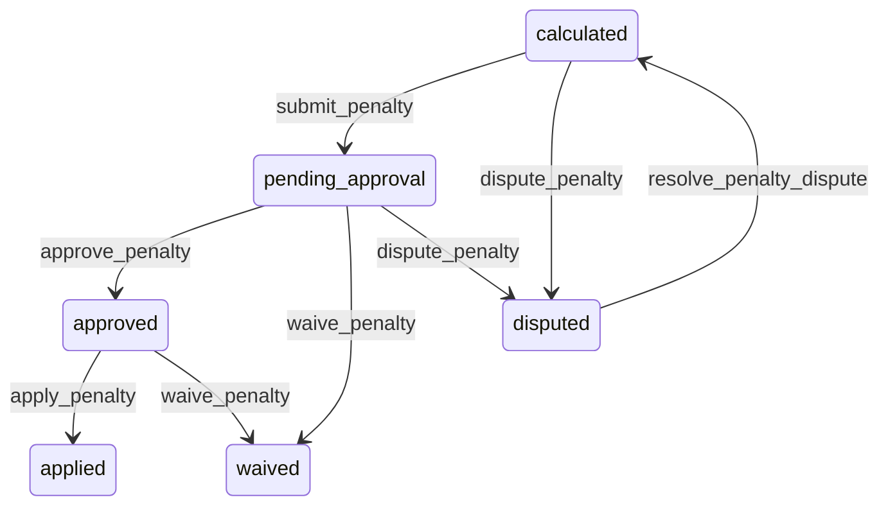

# State machine — Penalty Obligation

*Generated. Edit `_model/capabilities/sla_contract.yaml`, not this file.*

## Transition matrix

| From \\ To | `calculated` | `pending_approval` | `approved` | `applied` | `waived` | `disputed` |
|---|---|---|---|---|---|---|
| **`calculated`** | · | `submit_penalty` | — | — | — | `dispute_penalty` |
| **`pending_approval`** | — | · | `approve_penalty` | — | `waive_penalty` | `dispute_penalty` |
| **`approved`** | — | — | · | `apply_penalty` | `waive_penalty` | — |
| **`applied`** | — | — | — | · | — | — |
| **`waived`** | — | — | — | — | · | — |
| **`disputed`** | `resolve_penalty_dispute` | — | — | — | — | · |

Any transition marked `—` attempted at runtime returns `E_PRECONDITION`. It is never a silent no-op, because a silent no-op is how an operator believes work was recorded when it was not.

## Stuck-state policy

### `calculated`

Threshold: penalty_submission_days (default 3) after the measurement period closes. Told: finance. Escape hatch: submit. A calculated obligation that is never submitted means a performance report showing breaches and an invoice showing no credit, which the counterparty will notice before the tenant does.

### `pending_approval`

Threshold: penalty_approval_days (default 7), escalating to tenant_owner. Told: finance and the contract owner. Escape hatch: approve or waive. Never auto-approved and never auto-waived - one moves money without authorisation and the other silently abandons a contractual obligation.

### `approved`

Approved and unapplied is the state where the two systems diverge. Threshold: penalty_application_hours (default 48). Told: finance and platform_operator. Escape hatch: apply, or return to pending_approval. This is the same divergence the stopped measurement policy watches for, caught one stage later.

### `applied`

Terminal. Retained permanently with its applied_reference, which is the join between this capability's performance record and the billing capability's money record. Nothing pends.

### `waived`

Terminal. Retained with the reason and the waiving principal. The monitored condition is a pattern - waivers exceeding waiver_rate_alert of obligations (default 0.3) over a year, reported to tenant_owner, because habitual waiving means either the targets are wrong or the penalty regime is not real, and both are worth knowing deliberately rather than discovering during a renegotiation.

### `disputed`

Threshold: penalty_dispute_days (default 14), escalating to tenant_owner. Told: both parties. Escape hatch: resolve. No expiry, for the same reason as attendance disputes - an expiring dispute resolves in favour of whoever raised the number.

