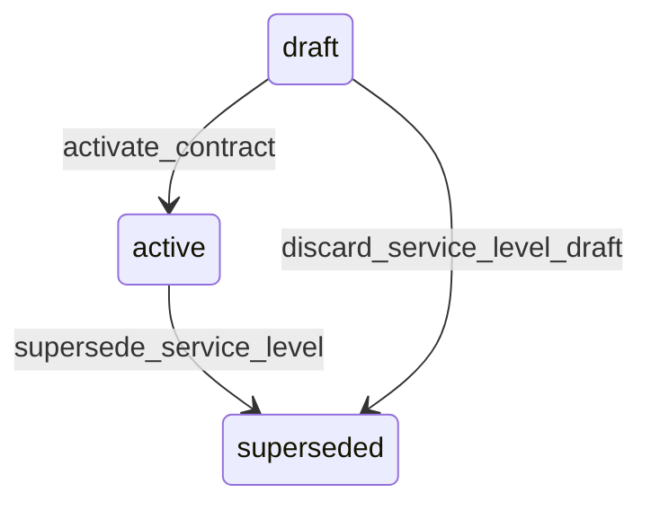

# State machine — Service Level

*Generated. Edit `_model/capabilities/sla_contract.yaml`, not this file.*

## Transition matrix

| From \\ To | `draft` | `active` | `superseded` |
|---|---|---|---|
| **`draft`** | · | `activate_contract` | `discard_service_level_draft` |
| **`active`** | — | · | `supersede_service_level` |
| **`superseded`** | — | — | · |

Any transition marked `—` attempted at runtime returns `E_PRECONDITION`. It is never a silent no-op, because a silent no-op is how an operator believes work was recorded when it was not.

## Stuck-state policy

### `draft`

Threshold: tied to the owning contract's draft policy rather than to its own timer, because a service level in draft under an active contract is the real problem and it is detected by the contract's own no-service-level monitor. Told: the contract owner. Escape hatch: activate with the contract, or discard.

### `active`

Two monitored exceptions. (a) A level whose breach rate exceeds chronic_breach_fraction (default 0.2) over two consecutive measurement periods - the target is unachievable with the current operation, and continuing to accrue penalties against it is a commercial conversation rather than an operational one. Told: the contract owner, finance and ops_manager. (b) A level that has produced zero measurements for measurement_dry_days (default 30) while its contract is active, which means applies_when_expression matches nothing and the obligation is invisible. Told: the contract owner. The second is the more dangerous of the two, because a target that is never measured reports as never breached.

### `superseded`

Terminal. Retained permanently, because running measurements resolved against it and a completed measurement must remain explicable years later. Nothing pends.

