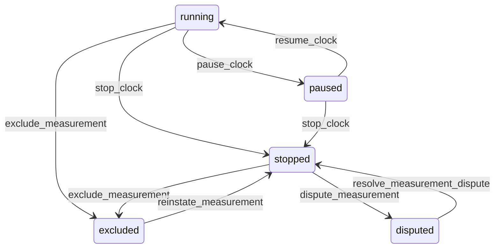

# State machine — SLA Measurement

*Generated. Edit `_model/capabilities/sla_contract.yaml`, not this file.*

## Transition matrix

| From \\ To | `running` | `paused` | `stopped` | `excluded` | `disputed` |
|---|---|---|---|---|---|
| **`running`** | · | `pause_clock` | `stop_clock` | `exclude_measurement` | — |
| **`paused`** | `resume_clock` | · | `stop_clock` | — | — |
| **`stopped`** | — | — | · | `exclude_measurement` | `dispute_measurement` |
| **`excluded`** | — | — | `reinstate_measurement` | · | — |
| **`disputed`** | — | — | `resolve_measurement_dispute` | — | · |

Any transition marked `—` attempted at runtime returns `E_PRECONDITION`. It is never a silent no-op, because a silent no-op is how an operator believes work was recorded when it was not.

## Stuck-state policy

### `running`

A running clock is normal. The monitored exception is the one that matters most in this capability: a clock that has passed target_at and is still running. It moves to outcome=breached_and_continuing and escalates on the level's own escalation tiers, because at that point the size of the eventual consequence is still controllable. Told: the record owner, the location supervisor, then ops_manager, then the contract owner. A second exception is a clock running longer than runaway_clock_multiple times its target (default 10), which almost always means the stop event never fired - a port failure rather than an operational failure - and it is reported to platform_operator as well, because the two look identical from a report and have completely different fixes.

### `paused`

The state most open to abuse, because pausing is how a target becomes meetable. Threshold: the level's max_pause_minutes where set, and otherwise pause_review_hours (default 24). Told: the record owner and ops_manager, with the pause reason and who applied it. Escape hatch: resume, or let the ceiling force it. A pause pattern - one reason accounting for more than pause_reason_concentration of all paused minutes (default 0.6) - is reported to the contract owner, because that is either a genuine systemic dependency worth renegotiating or a habit.

### `stopped`

Terminal in measurement terms. The monitored exception is a breached measurement whose penalty obligation has not been raised within obligation_lag_minutes (default 15), which means the penalty machinery is not running and a performance report will disagree with the penalty calculation. Told: platform_operator and finance. Two numbers for the same quarter is how a commercial relationship ends, so this monitor exists specifically to catch the divergence early.

### `excluded`

Threshold: excluded measurements are reviewed in aggregate each measurement period rather than individually. Where exclusions exceed exclusion_rate_alert of measurements in a period (default 0.05), the contract owner, finance and tenant_owner are told with the reasons grouped and the principals named. Escape hatch: reinstate, or accept. Exclusions are the easiest way to make a performance report say what is wanted, and the control is visibility rather than prohibition, because genuine exclusions are real and refusing them would make the report equally dishonest in the other direction.

### `disputed`

Threshold: measurement_dispute_days (default 10), escalating to tenant_owner. Told: both the counterparty, where a surface is bound, and finance. Escape hatch: resolve. The dependent penalty is HELD rather than cancelled while disputed, so that a dispute neither costs the tenant money prematurely nor lets it escape by delay.

