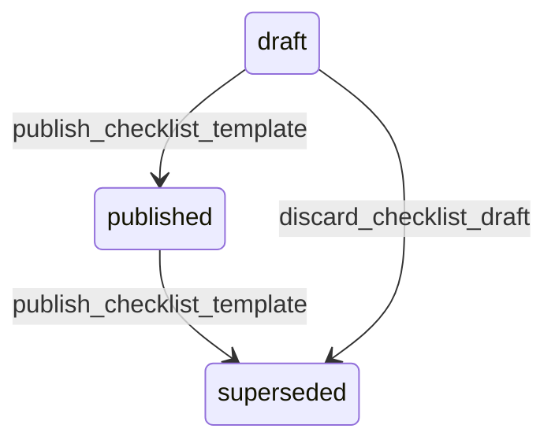

# State machine — Checklist Template

*Generated. Edit `_model/capabilities/work_order.yaml`, not this file.*

## Transition matrix

| From \\ To | `draft` | `published` | `superseded` |
|---|---|---|---|
| **`draft`** | · | `publish_checklist_template` | `discard_checklist_draft` |
| **`published`** | — | · | `publish_checklist_template` |
| **`superseded`** | — | — | · |

Any transition marked `—` attempted at runtime returns `E_PRECONDITION`. It is never a silent no-op, because a silent no-op is how an operator believes work was recorded when it was not.

## Stuck-state policy

### `draft`

Threshold: draft_checklist_stale_days (default 14). Told: the creating principal. Escape hatch: publish or discard. The specific confusion here is acute - a supervisor who edited a checklist and did not publish it will believe the field workforce is answering the new questions.

### `published`

Steady state. Monitored exception: an item answered identically on more than uniform_answer_alert of completions (default 0.98) over a quarter. Either the question has one correct answer and does not need asking, or nobody is reading it and everybody is tapping the default. Both are worth knowing and neither is detectable any other way. Told: the template owner, quarterly, advisory only.

### `superseded`

Terminal. Retained permanently, because completed work orders reference it and their answers are meaningless without the questions. Nothing pends.

