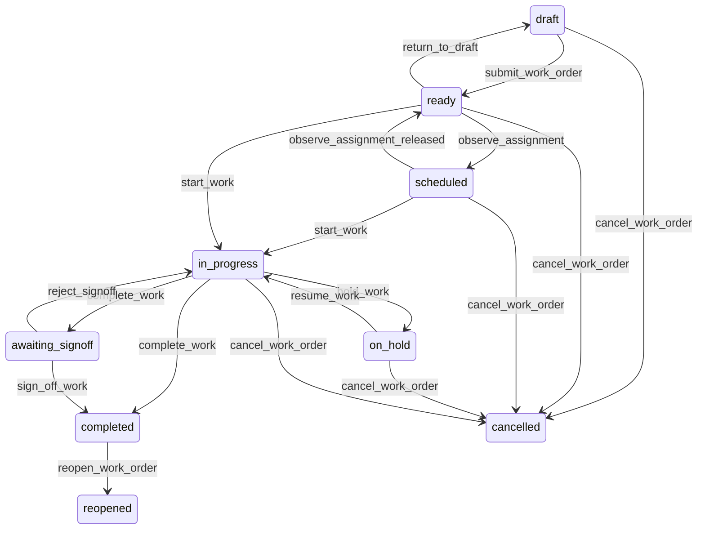

# State machine — Work Order

*Generated. Edit `_model/capabilities/work_order.yaml`, not this file.*

## Transition matrix

| From \\ To | `draft` | `ready` | `scheduled` | `in_progress` | `on_hold` | `awaiting_signoff` | `completed` | `cancelled` | `reopened` |
|---|---|---|---|---|---|---|---|---|---|
| **`draft`** | · | `submit_work_order` | — | — | — | — | — | `cancel_work_order` | — |
| **`ready`** | `return_to_draft` | · | `observe_assignment` | `start_work` | — | — | — | `cancel_work_order` | — |
| **`scheduled`** | — | `observe_assignment_released` | · | `start_work` | — | — | — | `cancel_work_order` | — |
| **`in_progress`** | — | — | — | · | `hold_work` | `complete_work` | `complete_work` | `cancel_work_order` | — |
| **`on_hold`** | — | — | — | `resume_work` | · | — | — | `cancel_work_order` | — |
| **`awaiting_signoff`** | — | — | — | `reject_signoff` | — | · | `sign_off_work` | — | — |
| **`completed`** | — | — | — | — | — | — | · | — | `reopen_work_order` |
| **`cancelled`** | — | — | — | — | — | — | — | · | — |
| **`reopened`** | — | — | — | — | — | — | — | — | · |

Any transition marked `—` attempted at runtime returns `E_PRECONDITION`. It is never a silent no-op, because a silent no-op is how an operator believes work was recorded when it was not.

## Stuck-state policy

### `draft`

Threshold: draft_work_order_stale_days (default 3) - deliberately short, because a draft work order is usually somebody who started reporting a problem and was interrupted, and the problem is still there. Told: the creating principal, then the supervisor of the location. Escape hatch: submit or cancel. No auto-submit, because an incomplete work order dispatched to somebody is a wasted journey.

### `ready`

Ready and unassigned is the queue that decides whether commitments are met. It is deliberately NOT policed on a fixed timer here - the sla_clock port owns the contractual deadline and the scheduling capability owns the coverage risk. What this capability monitors is the case where NEITHER is bound: a ready order with no due_at and no assignment for unassigned_no_deadline_days (default 7). Told: the supervisor of the location. Escape hatch: assign, set a due date, or cancel. This is stated explicitly because an order with no clock and no scheduler is invisible to every other mechanism.

### `scheduled`

Bounded by the assignment window. The monitored exception is a scheduled order whose assignment window has passed without the work starting, which is the scheduling capability's no_show but seen from the work side. Told: the supervisor, at scheduled_not_started_minutes (default 60) past the window start. Escape hatch: start, reschedule, or record the no-show. The two capabilities deliberately both notice, because either one being unbound must not make the condition invisible.

### `in_progress`

Work that starts and never finishes is the largest silent liability in a field operation - the labour is being incurred and no outcome is recorded. Threshold: in_progress_alert_hours (default 8), and a second escalation at four times that. Told: the assignee first, then the supervisor. Escape hatch: complete, hold with a reason, or cancel. Verity never auto-completes. An auto-completed work order produces an outcome nobody chose and, where a billable sink is bound, an invoice line nobody can defend.

### `on_hold`

A hold is meant to be short and is the state most likely to become permanent, because it feels like progress. Threshold: depends on the hold reason, configured per reason with a default of hold_review_days (default 3). Told: the assignee and the supervisor, escalating to ops_manager at twice the threshold. Escape hatch: resume, or cancel with the reason preserved. A hold whose reason is awaiting-a-third-party is reported with the elapsed time in the counterparty communication, because that is the number that moves the conversation.

### `awaiting_signoff`

Completed work waiting on somebody else's confirmation, during which it is not billable and not closed. Threshold: signoff_deadline_hours (default 48). Told: the signer, then the supervisor. Escape hatch: sign off, reject, or escalate to a supervisor sign-off where the work_type permits substitution. Auto-sign-off after a timeout is offered as tenant configuration and is OFF by default, because an auto-signed work order is evidence of nothing and it is the counterparty who will say so.

### `completed`

Terminal unless reopened. The one thing that still pends is downstream: where a billable_outcome_sink is bound, a completed order whose billable event has not been acknowledged within outcome_ack_hours (default 4) is reported to platform_operator, because a completion that never reached billing is revenue that disappears silently and is only ever found by reconciling two systems by hand.

### `cancelled`

Terminal. Retained with the reason and with any labour, travel and parts recorded before cancellation, because those were still incurred and somebody may still be paid or billed for them. Nothing pends.

### `reopened`

Terminal on this order - the successor carries the work. Not a queue. The monitored exception is a chain: an order reopened more than reopen_chain_alert times (default 2) in sequence. Told: ops_manager and the owner of the work_type, because a third reopen is a problem with the work definition, the parts or the person, and none of those get better by opening a fourth order.

