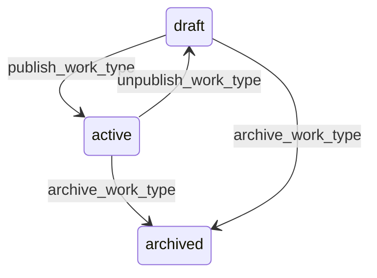

# State machine — Work Type

*Generated. Edit `_model/capabilities/work_order.yaml`, not this file.*

## Transition matrix

| From \\ To | `draft` | `active` | `archived` |
|---|---|---|---|
| **`draft`** | · | `publish_work_type` | `archive_work_type` |
| **`active`** | `unpublish_work_type` | · | `archive_work_type` |
| **`archived`** | — | — | · |

Any transition marked `—` attempted at runtime returns `E_PRECONDITION`. It is never a silent no-op, because a silent no-op is how an operator believes work was recorded when it was not.

## Stuck-state policy

### `draft`

Threshold: draft_work_type_stale_days (default 30). Told: the creating principal. Escape hatch: publish or archive. Low operational risk, high confusion risk - somebody configured a kind of work and believes people can select it.

### `active`

Two monitored exceptions. (a) A type whose reopen rate over a rolling quarter exceeds reopen_rate_alert (default 0.15) - the work definition, the parts list or the allotted duration is wrong, and this is the most actionable quality signal the capability produces. Told: ops_manager and the type's owner, quarterly. (b) A type whose evidence requirements can no longer be satisfied because a port was unbound. Told immediately, because otherwise every completion silently falls back to the override path.

