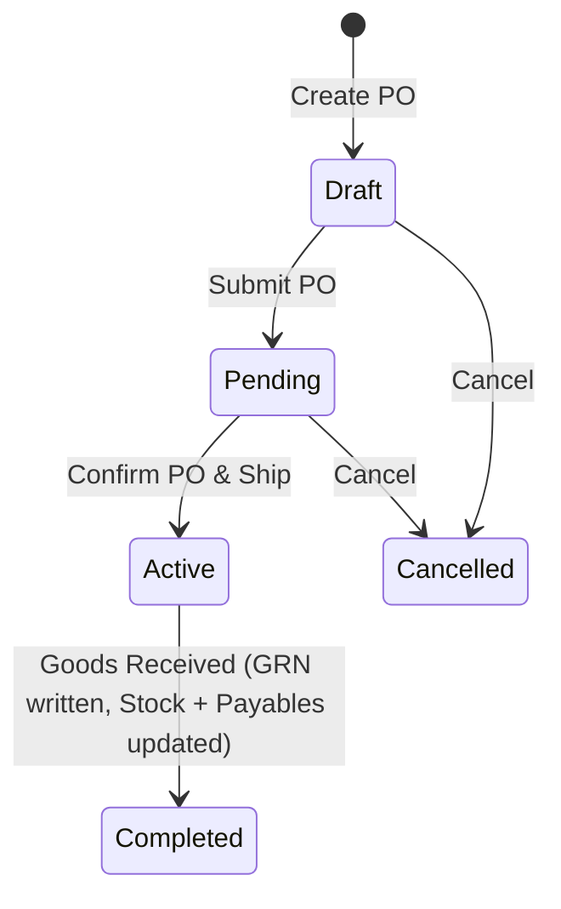
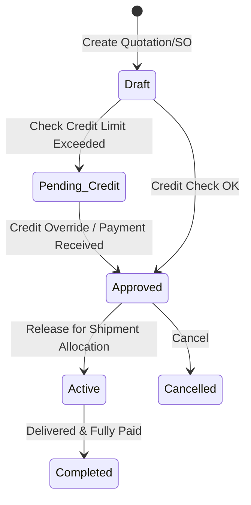
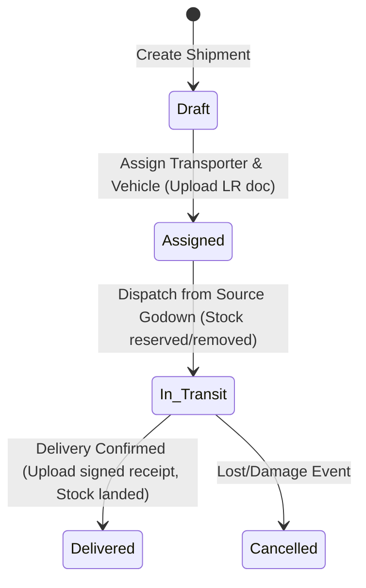

# Plywood Trading Business — Verity Capability Design

| | |
|---|---|
| **Client profile** | Plywood, laminate, MDF, and board trading business with multiple godowns, transport tracking, sales & purchases, ledger accounts, and GST invoicing. |
| **Document status** | **DEMONSTRATED** — a hypothetical capability modelled on the foundation, on paper. Nothing in this document is BUILT. Per the reporting vocabulary, no part of it may be reported as implemented functionality until it exists in `src/server/capabilities/` behind passing tests. |
| **Proposed capability id** | `verity.capability.plywood` |
| **Proposed pack framing** | None. One purpose-built reusable capability, not an industry pack. |
| **Platform state at writing** | Foundation frozen at 2026-08-24 milestone (`implementation/PLATFORM-FREEZE.md`). Five platform-proving capabilities exist: Location, Asset, Evidence, Scheduling, Approval. |

---

## 1. Client requirements (as received)

A plywood, laminate, MDF, and board trading management system covering:

1. **Inventory Management (Core)**
   - Plywood/laminate/MDF/board product master (Brand, Thickness, Size/dimensions, Grade, Sheet/unit count).
   - Stock by warehouse/godown.
   - Stock inward/outward and stock transfers.
   - Damaged/returned stock and physical stock adjustment.
   - Low-stock alerts and stock valuation.
2. **Purchase & Supplier Management**
   - Supplier master and supplier-wise pricing.
   - Purchase orders, purchase invoices, and goods received.
   - Pending purchases, supplier outstanding, and supplier ledger / purchase history.
3. **Sales & Customer Management**
   - Customer/dealer/contractor master.
   - Quotations and sales orders.
   - Price lists, customer-specific pricing, and credit limits.
   - Outstanding payments, sales history, and returns.
4. **Finance / Accounts (Core Care Area)**
   - Sales invoices, purchase invoices, receivables, and payables.
   - Customer ledger and supplier ledger.
   - Payment collection and payment entries.
   - Credit/debit notes and GST-ready invoice data.
   - Profit/margin tracking and daily/monthly financial reports.
5. **Invoice Generation**
   - Professional GST invoices and delivery challans.
   - E-invoice/e-way bill integration later if required (out of scope for v1 / manual placeholders).
   - PDF/print/share, invoice numbering, payment status, and outstanding against invoice.
6. **Logistics (Major Requirement)**
   - Track flow: Purchase → Supplier → Transport → Godown → Customer.
   - Transporter master, vehicle details, and LR/transport documents.
   - Incoming shipment, outgoing shipment, dispatch, delivery status, and delivery confirmation.
   - Freight charges, who is paying freight, and material currently in transit.
   - Primary owner questions answered:
     - *"Mera maal abhi kahan hai?"* (Where is my material right now?)
     - *"Kis customer ko kya bheja hai aur deliver hua ya nahi?"* (What has been sent to which customer, and is it delivered or not?)
7. **Warehouse / Godown (First-Class Module)**
   - Multiple godowns with rack/location tracking.
   - Stock by godown and inter-godown transfer.
   - Receiving, dispatch, stock count, damaged stock, and reserved stock.
8. **Dashboard**
   - Owner dashboard: Today's Sales | Today's Purchases | Stock Value | Receivables | Payables | Pending Deliveries | In-Transit Material | Low Stock.
   - Drill-down capabilities for all metrics.

### Derived operational requirements (made explicit so scope is testable)
- **Paise-granular arithmetic**: All pricing, invoice totals, payments, and ledger balances are stored in integer minor units (paise) to prevent float representation drift.
- **Append-only Ledgers**: Stock ledger movements and financial ledger entries are append-only. Once written, they are never edited or deleted; adjustments are recorded as new transaction lines with mandatory reason references.
- **Transporter Handoffs & LR (Lorries Receipt)**: Shipping transitions require a document/number reference (LR No.) and a transit state machine (In Transit -> Delivered) to satisfy tracking queries.
- **Tax Breakdown Preservation**: Invoices snapshot CGST, SGST, IGST rates and values at execution. Catalogue edits never retrospectively alter tax or price totals on completed bills.

### Explicitly not requested and therefore out of scope for v1
- Live GPS telemetry / maps (location tracking is manual status update by logistics coordinators).
- Automatic API integration with government E-invoice / E-way bill portals (system records e-way bill number and uploads PDFs as Evidence).
- Multi-currency support (exclusively local INR).
- Multi-tenant shared stock (tenancy boundary remains absolute under INV-001).
- Automated barcode scanner hardware integrations (manual search and select is standard).

---

## 2. Authority position

### 2.1 The decision path this document follows
`implementation/PLATFORM-FREEZE.md`: *can existing Verity primitives support it? If yes, build the capability; if no, smallest additive extension justified in writing.*
- **Godowns** map to the platform's `Location` primitive.
- **Delivery vehicles** map to the platform's `Asset` primitive.
- **Transport documents, LR scans, and invoice PDFs** map to the platform's `Evidence` primitive (stored checksum-frozen files).
- **Sales Orders, Purchase Orders, and Shipments** map to the platform's `Work` primitive (each is a unit of service execution with dynamic states under commands).
- **B2B Partners (Customers, Suppliers, Transporters)** map to capability-owned entities that link to `Party` records when logins are required (e.g. for transporter tracking).
- No core platform changes are proposed; all models are capability-private database extensions.

### 2.2 Scope boundaries
- **GOV-SCO-006** (consumer retail storefronts and POS hardware out of scope): The billing flow is **record-and-print**. No cash drawer hooks, physical card terminals, or payment gateway APIs.
- **PLATFORM-FREEZE**: No generic financial ledger framework or double-entry engine is added to platform core. All ledger mappings are capability-private, simple tables.

### 2.3 Canonical terminology compliance
All names respect GOV-TER-001..017.
- **`Location`** is used for Warehouses and Godowns.
- **`Asset`** is used for Vehicles.
- **`Work`** instances are `SalesOrder`, `PurchaseOrder`, and `Shipment`.
- **`Customer`**, **`Supplier`**, and **`Transporter`** are capability-owned entities.
- **`Evidence`** is used for LR documents and signed delivery receipts.

---

## 3. Platform fit — requirement → primitive map

| Plywood requirement | Existing primitive that carries it | Status of primitive |
|---|---|---|
| Tenant isolation | Tenant + RLS via `withTenant()`; fail-closed GUC | BUILT / PROVEN |
| Staff and Partner logins | Supabase Auth + Party/User/TenantMembership | BUILT / PROVEN |
| Godowns / Warehouses | `Location` primitive (Place + Address) | BUILT / PROVEN |
| Delivery Vehicles | `Asset` primitive | BUILT / PROVEN |
| LR documents, confirmation signatures | `Evidence` (checksum-frozen `StoredFile` references) | BUILT / PROVEN |
| Sales Orders, POs, Shipments | `Work` primitive (dynamic state machines via `StateDefinition`) | BUILT / PROVEN |
| Stock / Financial Ledgers | Capability-owned append-only tables | DEMONSTRATED |
| GST Invoice PDFs | `Evidence` / `StoredFile` two-phase contract | BUILT / PROVEN |
| Owner Alerts (Low Stock, Exceeded Credit) | Notification substrate (`notify()`, templates, suppressions) | BUILT |
| Dashboard KPI statistics | Server components + chart primitives (`Donut`, `BarStrip`), workspace contributions | BUILT |

---

## 4. Tenant & organization topology

```
Tenant: "National Plywood Distributors"   timeZone: Asia/Kolkata (configurable at provisioning)
└── Organization: "Central HQ & Office"   (HQ staff: Owner, Sales, Finance, Logistics)
    ├── Location: "Godown A - Okhla"      (Godown staff, Rack/location structure)
    └── Location: "Godown B - Noida"      (Godown staff, Rack/location structure)
```

---

## 5. Staff identity, roles & permissions

### 5.1 Roles
Closed set of roles for the plywood capability:
- `Owner`: Full management control over margins, stock adjustments, financial reports, ledger corrections, and configuration.
- `Warehouse Clerk`: Manages stock inward/outward, inter-godown transfers, dispatches, and physical stock counts.
- `Sales Representative`: Manages quotations, sales orders, price lists, customer profiles, and collections.
- `Purchase Representative`: Manages supplier profiles, purchase orders, purchase invoices, and GRN checks.
- `Logistics Coordinator`: Manages transporters, vehicle listings, shipping documents (LR), dispatches, transit updates, and delivery status updates.
- `Finance Accountant`: Manages customer/supplier outstanding ledgers, tax data, invoicing, and profit tracking.

### 5.2 Permission matrix
Verbs from the closed set (PLA-AUT-003); actions ride `ActionExecute`. All grants at Tenant level.

| Entity | Read | Create | Edit | Delete | ActionExecute |
|---|---|---|---|---|---|
| `verity.plywood.product` | All | Owner, Warehouse | Owner, Warehouse | — | — |
| `verity.plywood.stock_ledger` | All | (auto via movements) | — | — | adjust-stock (Owner) |
| `verity.plywood.sales_order` | Owner, Sales, Finance, Log | Sales | Sales (draft only) | — | approve-credit (Owner, Finance), ship (Logistics) |
| `verity.plywood.purchase_order`| Owner, Purchase, Warehouse | Purchase | Purchase (draft only)| — | receive-goods (Warehouse) |
| `verity.plywood.shipment` | All | Logistics, Purchase | Logistics | — | dispatch (Logistics), confirm-delivery (Logistics) |
| `verity.plywood.customer` | Owner, Sales, Finance | Sales | Sales | — | block-credit (Owner, Finance) |
| `verity.plywood.supplier` | Owner, Purchase, Finance | Purchase | Purchase | — | — |
| `verity.plywood.invoice` | Owner, Finance, Sales | Finance | — | — | print, record-payment (Finance, Sales) |
| `verity.plywood.finance_ledger` | Owner, Finance | (auto via actions) | — | — | correct-ledger (Owner) |

---

## 6. Domain model — modules and entities

Every model carries the base-entity shape (`id, tenantId, createdAt, updatedAt, version, customFields`) and is protected by the default RLS policy. Money is stored in paise (`pricePaise`).

### Module M1 — Product Catalog (`verity.plywood.product`, `verity.plywood.brand`)
- **Brand**: `name`, `active`.
- **Product**: `brandId FK`, `name`, `thicknessMm Int` (basis points/tenths, e.g. 180 for 18.0mm), `widthMm Int`, `heightMm Int`, `grade` (e.g. BWR, MR, Marine), `sheetWeightKg Int?`, `reorderLevelUnits Int`, `unitLabel` (default "sheets").

### Module M2 — Inventory & Godowns (`verity.plywood.stock_ledger`, `verity.plywood.godown_rack`)
- **GodownRack**: `locationId FK` (Location primitive), `rackLabel String`.
- **StockLedger**: `productId FK`, `locationId FK`, `rackId FK?`, `kind` (`purchase_inward | sales_outward | transfer_in | transfer_out | adjust_in | adjust_out | returned_stock`), `qtyUnits Int`, `unitCostPaise Int` (valuation source), `refEntityKey String?`, `refEntityId Uuid?`, `reason String?`, `byUserId FK`. **Append-only.**

### Module M3 — Purchase & Supplier Management (`verity.plywood.supplier`, `verity.plywood.purchase_order`, `verity.plywood.supplier_pricing`)
- **Supplier**: `displayName`, `gstin String?`, `phone String?`, `email String?`, `outstandingBalancePaise Int`.
- **PurchaseOrder**: `supplierId FK`, `state` (`draft | pending | active | completed | cancelled`), `items Json` (`[{productId, name, qtyOrdered, qtyReceived, unitCostPaise}]`), `totalCostPaise Int`.
- **SupplierPricing**: `supplierId FK`, `productId FK`, `negotiatedCostPaise Int`.

### Module M4 — Sales & Customer Management (`verity.plywood.customer`, `verity.plywood.sales_order`, `verity.plywood.customer_pricing`)
- **Customer**: `displayName`, `gstin String?`, `phone String?`, `creditLimitPaise Int`, `outstandingBalancePaise Int`.
- **SalesOrder**: `customerId FK`, `state` (`draft | pending_credit | approved | active | completed | cancelled`), `items Json` (`[{productId, name, qtyOrdered, qtyShipped, unitPricePaise}]`), `totalPricePaise Int`.
- **CustomerPricing**: `customerId FK`, `productId FK`, `customPricePaise Int`.

### Module M5 — Logistics & Shipment Tracking (`verity.plywood.transporter`, `verity.plywood.shipment`)
Tracks: Supplier/Godown → Transport → Godown/Customer.
- **Transporter**: `name`, `phone String?`, `email String?`, `vehicleDetails String?`.
- **Shipment**: 
  - `transporterId FK?`,
  - `vehicleAssetId FK?` (Asset primitive reference),
  - `lrNumber String?` (Lorries Receipt / tracking reference),
  - `sourceLocationId FK` (Location primitive),
  - `destLocationId FK?` (inter-godown transfer location),
  - `destCustomerId FK?` (customer sales order location),
  - `refEntityKey String` (`sales_order | purchase_order`),
  - `refEntityId Uuid`,
  - `freightChargePaise Int @default(0)`,
  - `freightPayer` (`tenant | customer | supplier`),
  - `lrEvidenceId FK?` (Evidence primitive link to scan),
  - `deliveryEvidenceId FK?` (Evidence primitive link to signed receipt),
  - `state` (`draft | assigned | in_transit | delivered | cancelled`),
  - `dispatchedAt DateTime?`,
  - `deliveredAt DateTime?`.

### Module M6 — Finance & Accounts (`verity.plywood.finance_ledger`, `verity.plywood.invoice`, `verity.plywood.payment_entry`)
- **Invoice**: `customerId FK?`, `supplierId FK?`, `refEntityKey String` (`sales_order | purchase_order`), `refEntityId Uuid`, `cgstPaise Int`, `sgstPaise Int`, `igstPaise Int`, `taxablePaise Int`, `totalPaise Int`, `paymentStatus` (`unpaid | partial | paid`), `outstandingPaise Int`.
- **PaymentEntry**: `invoiceId FK`, `partyType` (`customer | supplier`), `partyId Uuid`, `method` (`bank | upi | cash`), `amountPaise Int`, `reference String?` (UTR/UPI TxId), `paymentDate DateTime`.
- **FinanceLedger**: `partyType` (`customer | supplier`), `partyId Uuid`, `entryType` (`debit | credit`), `amountPaise Int`, `invoiceId FK?`, `paymentEntryId FK?`, `runningBalancePaise Int`, `createdAt DateTime`. **Append-only.**

---

## 7. Operational flows & state transitions

### 7.1 Purchase flow


### 7.2 Sales & credit flow


### 7.3 Logistics & tracking flow
Answering: *"Mera maal abhi kahan hai?"* (Where is my material right now?)


---

## 8. UI/UX layout, pages & workspaces contribution

### 8.1 Workspaces
1. **Owner Console**
   - KPI Strip (Today's Sales, Purchases, Stock Value, Receivables, Payables, Pending Deliveries, In-Transit Material, Low Stock).
   - Margin and Profit Chart (based on Invoiced sales price vs average stock cost).
   - Audit trail and security log tabs.
2. **Inventory Manager Workspace**
   - Godown Selector grid (Stock distribution list by warehouse, rack level).
   - Inter-Godown Transfer card.
   - Low-Stock alerts column and physical adjustment forms.
3. **Sales & Customer Workspace**
   - Customer Master & Outstanding Ledger panel.
   - Sales Order booking card.
   - Outstanding payment follow-ups dashboard.
4. **Purchase & Supplier Workspace**
   - Supplier ledger and pricing card.
   - Purchase order generator.
   - Incoming delivery schedule calendar.
5. **Logistics Control Centre**
   - Live Dispatch queue.
   - Transporter registry and asset fleet allocation.
   - **Shipment Locator Input**: A prominent search field allowing the owner or logistics coordinator to input a Customer Name, Sales Order, or LR Number and immediately receive a status map (e.g. *Supplier → Transporter [Vehicle No, LR] → In-Transit [Since 2 days] → Destination Godown*).

---

## 9. Open gaps/decision points

> [!WARNING]
> **E-Way Bill & GST Portal Automation**
> Portal integration is deferred to manual file uploading in v1. Building automated government API gateways introduces substantial external dependencies and maintenance costs. The platform will instead record the Government reference ID and hold a PDF scan as `Evidence`.
